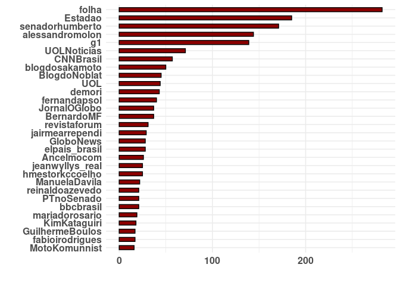
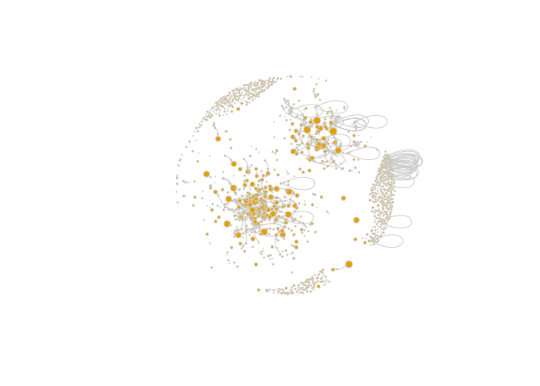
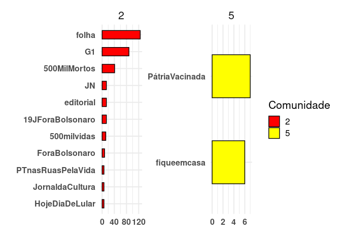
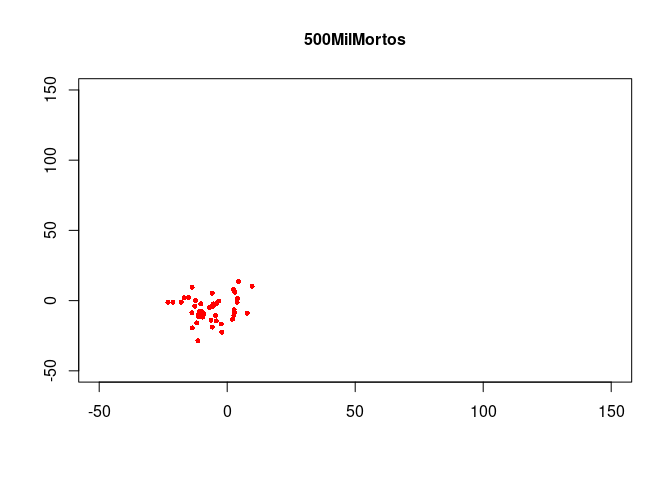
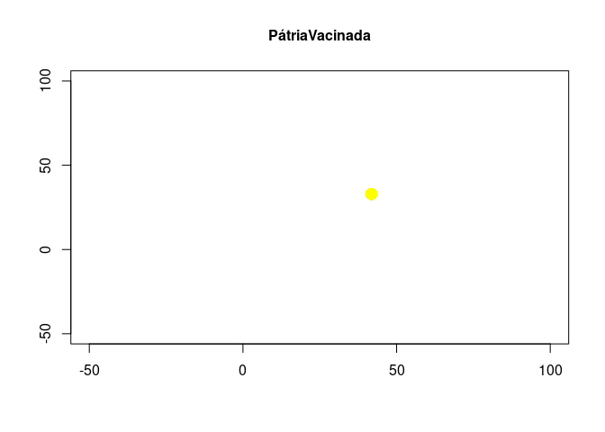

Acesso a dados do Twitter.
==========================

Para acessar a API do Twitter, utilizaremos o pacote
[rtweet](https://github.com/ropensci/rtweet). Nosso primeiro passo é
instalar o pacote.

``` r
# Ativar rtweet
#install.packages("rtweet") # somente uma vez
library(rtweet)
# ativar outros pacotes
library(tidyverse)
library(igraph)
library(broom)
library(here)
here()
```

    [1] "/home/venturat/Dropbox/SICSS_Rio/materials/materials/tutorial_dapp_sicss/tutorial_dapp_day"

Solicitando sua credenciais.
----------------------------

Conforme aprendemos na semana passada, algumas APIs exigem um cadastro
prévio para dar a devida autorização para seus acessos a dados. Este é o
caso do Twitter. Para solicitar as credenciais, vocÊ precisa: 1) ter uma
conta no twitter, 2) criar uma conta de desenvolvedor do twitter. O
pacote `rtweet` possui um excelente tutorial sobre como solicitar acesso
de desenvolvedor.

``` r
vignette("auth", package = "rtweet")
```

Após receber suas credenciais, você deve fazer seu login. Primeiro vamos
criar objetos com nossas chaves.

Agora, vamos liberar nosso acesso.

``` r
create_token(app=app_name,
             consumer_key=consumer_key, 
             consumer_secret=consumer_secret,
             access_token = access_token, 
             access_secret = access_token_secret)
```

Pronto. A função create_token salva no seu ambiente do R sua senha de
acesso. A priori, se estiver funcionando corretamente, você não precisa
repetir essa autorização outras vezes. Para testar, você pode abrir e
fechar sua sessão no R para verificar o funcionamento.

Rest API: Acessar tweets antigos.
---------------------------------

O Twitter possui duas API: Rest API e Stream API. Vamos começar com a
REST API. Esta API permite:

-   Acesso a tweets dos últimos 6-9 dias.

-   18.000 tweets em cada acesso de 15 minutos.

Para usar esta função, você precisa entrar um termo de busca. A busca
avançada no Twitter ajuda a formatar os termos de busca adequados quando
seu interesse está em mais de uma simples palavras.

``` r
# Carregar os dados que baixei antes aqui.
load("tutorial_twitter.RData")
```

``` r
# Recentemente o argumento retryonratelimit não tem funcionado com minhas credenciais. 
# Abri um issue no github, mas não foi resolvido. 
# Então caso vocês tenham o mesmo problema, uma possível solução seria 
# escrever um loop. Ou usar o twarc em Python para coletar dados e depois fazer as análises em R. 


covid_tweets <-search_tweets("covid OR covid-19", 
                             lang="pt",
                             n=50000, 
                             include_rts = TRUE,
                             retryonratelimit = TRUE)
#Checar se vieram retuites
covid_tweets$is_retweet
```

API Stream
==========

O Twitter possui uma segunda API onde você pode coletar uma amostra dos
tweets sendo produzidos em tempo real. Esta API lhe dá mais acesso a
dados, então é a melhor forma de coletar, você pode deixar algumas horas
– ou dias – rodando no seu R.

``` r
dados_bolsonaro_stream <- stream_tweets("bolsonaro", 
                                        timeout = 10, 
                                        file_name = "bolsonaro.json") # adicione o tempo que voce quer coletar 
```

Análise de Redes.
=================

Pensando em Redes
=================

Há milhões de formas de análisar dados de twitter. Porém, um dos
elementos centrais em plataformas como estas é o fato dos usuários
interagirem entre si. Portanto, estes usuários se conectam em redes.

Uma rede possui dois elementos básicos: um nó - usuário - e um link -
que iremos considerar um retweet. Para construir nossa rede, vamos
selecionar usuários a partir dos seus retuítes. Esta é a forma mais
básica de análise de redes do Twitter, e com isto vamos replicar alguns
resultados do artigo do “Time to Protest” de Calvo e Aruguete.

Para construir a rede de conexões, vamos usar o pacote `igraph`. Este
pacote armazena dados de forma um tanto distinta, porém, é a forma mais
intuitiva de manipular dados de rede em R.

Construíndo uma rede
--------------------

### Passo 1: Selecione os nós – Autoridades -\> Hub

-   Autoridades: Autor do Tweet \<-

-   Hub: Autor do Retweet -\>

``` r
# Segura somente retuite
library(tidyverse)

dados_covid_rt <- covid_tweets %>%
                          filter(is_retweet==TRUE)

# Criar uma edgelist = lista de conexoes da sua rede
data <- cbind(dados_covid_rt$screen_name, dados_covid_rt$retweet_screen_name)
head(data)
```

         [,1]         [,2]             
    [1,] "nppgomes"   "LeoJaime"       
    [2,] "SrDuDu12"   "JanainaDoBrasil"
    [3,] "SrDuDu12"   "CarlosBolsonaro"
    [4,] "SrDuDu12"   "JanainaDoBrasil"
    [5,] "ttgarcia"   "MottaTarcisio"  
    [6,] "CothyNunes" "MarceloCRedeTV" 

### Passo 2: Crie a estrutura da rede

``` r
library(igraph)

# Cria um rede vazia

net <- graph.empty() 

# Adiciona os nós = vertices
net <- add.vertices(net, 
                    length(unique(c(data))), # número de nós
                    name=as.character(unique(c(data)))) # nomes unicos


# Add edges
net <- add.edges(net, t(data))

summary(net)
```

    IGRAPH a4940c1 DN-- 11403 13361 -- 
    + attr: name (v/c)

``` r
# Ou
g <- graph_from_data_frame(d=data, vertices=unique(c(data)))

summary(g)
```

    IGRAPH 88ee13c DN-- 11403 13361 -- 
    + attr: name (v/c)

``` r
summary(net)
```

    IGRAPH a4940c1 DN-- 11403 13361 -- 
    + attr: name (v/c)

### Passo 3: Adicione as variáveis

``` r
E(net)$text <- dados_covid_rt$text
E(net)$nameauth <- dados_covid_rt$screen_name
E(net)$namehub <- dados_covid_rt$retweet_screen_name
E(net)$web <- dados_covid_rt$urls_expanded_url
E(net)$hash <- dados_covid_rt$hashtags 
```

Estatística de Rede, Comunidades e Layout.
------------------------------------------

Vamos usar aqui o conceito de in-degree e out-degree. In-degree
significa quantos links direcionados a si o usuário possui. Portanto, em
nosso caso mostra quantos retweets este usuário recebeu. O oposto
explica out-degree. Neste caso, out-degree significa quantos retuites o
usuario deu.

Um usuário é chamado de autoridade quando seu in-degree é alto. Ou seja,
muitos usuários o-a retuítam. Chamamos de hub quando seu out-degree é
alto, pois este usuário retuíta muito frequentemente. Os robôs do
Bolsonaro são, portanto, hubs – ninguém retuíta eles, eles somente
retuítam muito, e muito rápido.

``` r
# Adicionar indegree and outdegree
V(net)$outdegree<-degree(net, mode="out")
V(net)$indegree<-degree(net, mode="in")
summary(net)
```

    IGRAPH a4940c1 DN-- 11403 13361 -- 
    + attr: name (v/c), outdegree (v/n), indegree (v/n), text (e/c),
    | nameauth (e/c), namehub (e/c), web (e/x), hash (e/x)

### Layout

Estima posições para os nós da sua rede, é um algoritimo que organiza a
topologia das rede de conexões

``` r
l <- layout_with_fr(net, grid = c("nogrid"))
head(l)
```

### Comunidades

Há vários algorítimos para encontrar comunidades (ou clusters) em sua
rede. Estes algorítimos em geral buscam subgrupos com mais conexões
dentro da sua rede. Não vamos entrar numa discussão detalhada sobre os
diferentes algorítimos. Ao final, os resultados são semelhantes.

``` r
my.com.fast <- walktrap.community(net)
```

Adicionando o layout a sua rede
===============================

``` r
V(net)$l1 <- l[,1]
V(net)$l2 <- l[,2]
V(net)$membership <- my.com.fast$membership
```

Quais as maiores comunidades?
-----------------------------

``` r
comunidades<- data_frame(membership=V(net)$membership)

comunidades %>% 
    count(membership) %>%
    arrange(desc(n)) %>%
    top_n(5)
```

    # A tibble: 5 x 2
      membership     n
           <dbl> <int>
    1          2  1390
    2          3   823
    3          5   708
    4          4   647
    5        208   498

Quem são os mais influentes em cada comunidade?
-----------------------------------------------

Para medir as autoridades de cada comunidades, irei primeiro selecionar
as principais autoridades por comunidade. Em seguida, plotaremos quem
são esses usuários, e quantos retuítes receberam neste período
pré-eleição.

``` r
# Cria um banco com indegree

autoridade <- data_frame(name=V(net)$name, ind=V(net)$indegree, 
                         membership=V(net)$membership) %>%
              filter(membership==2| membership==3|membership==5) %>%
              split(.$membership) %>%
              map(~ arrange(., desc(ind))) %>%
              map(~ slice(., 1:30)) 


# Comunidade 1

ggplot(autoridade[[1]], aes(x=reorder(name,
                               ind),
                     y=ind)) + 
    geom_histogram(stat="identity", width=.5, color="black", 
                   fill="darkred") +
  coord_flip() +
    xlab("") + ylab("") + 
  theme_minimal(base_size = 12) + 
  theme(plot.title = element_text(size = 22, face = "bold"), 
        axis.title=element_text(size=16), 
        axis.text = element_text(size=12, face="bold")) 
```



``` r
# Comunidade 2

ggplot(autoridade[[2]], aes(x=reorder(name,
                               ind),
                     y=ind)) + 
    geom_histogram(stat="identity", width=.5, color="black", 
                   fill="yellow") +
  coord_flip() +
    xlab("") + ylab("") + 
  theme_minimal(base_size = 12) + 
  theme(plot.title = element_text(size = 22, face = "bold"), 
        axis.title=element_text(size=16), 
        axis.text = element_text(size=12, face="bold")) 
```


``` r
# Comunidade 3

ggplot(autoridade[[3]], aes(x=reorder(name,
                               ind),
                     y=ind)) + 
    geom_histogram(stat="identity", width=.5, color="black", 
                   fill="steelblue") +
  coord_flip() +
    xlab("") + ylab("") + 
  theme_minimal(base_size = 12) + 
  theme(plot.title = element_text(size = 22, face = "bold"), 
        axis.title=element_text(size=16), 
        axis.text = element_text(size=12, face="bold")) 
```


Visualizar Comunidades
----------------------

Há muitos pacotes distintos para visualização de dados em rede em R.
Este tutorial
[aqui](https://www.jessesadler.com/post/network-analysis-with-r/) cobre
as principais opções. Vou apresentar a opção mais simples que vem
diretamente do `igraph`. Um outro caminho é utilizar extensões do
ggplot, como o ggnet e o ggraph. O problemas das extensões do ggplot é
que você precisa converter o objeto igraph para banco de dados, e este
processo tende a ser lento e gerar alguns erros.

``` r
# plot igraph
plot.igraph(net, 
            layout=cbind(V(net)$l2,V(net)$l1), 
            vertex.size=log(V(net)$indegree),
            vertex.label.color=1,
            vertex.label=NA,
            vertex.color=V(net)$new.color, 
            vertex.frame.color=gray(.8), 
            edge.color=gray(.8), 
            edge.arrow.size=.2, 
            edge.curved=TRUE)
```



``` r
# Ou esta outra opção mais manual. 

# Funcao para visualizar a rede
my.den.plot <- function(l=l,new.color=new.color, ind=ind, legend){
  library(KernSmooth)
  #Numero efectivo de Comunidades
  # ENCG<-round(1/sum(round(table(new.color)/sum(table(new.color)),3)^2),2)
  # 
  est <- bkde2D(l, bandwidth=c(10, 10))
  plot(l,cex=log(ind+1)/4, col=new.color, pch=16, xlim=c(-160,140),ylim=c(-140,120), xlab="", ylab="", axes=FALSE)
  contour(est$x1, est$x2, est$fhat,  col = gray(.6), add=TRUE)
  #text(-140,115,paste("ENCG: ",ENCG,sep=""), cex=1, srt=0)
} 

# Crie as cores para cada comunidade

# Building a empty containes
temp <- rep(1,length(V(net)$membership))
new.color <- "white"
new.color[V(net)$membership==2] <- "red" ####
new.color[V(net)$membership==3] <- "blue" ####
new.color[V(net)$membership==5] <- "yellow" ####

# Adiciona a nova cor
V(net)$new.color <- new.color


# Plot

#save first
my.den.plot(l=cbind(V(net)$l1,V(net)$l2),new.color=V(net)$new.color, ind=V(net)$indegre, legend =c("Pro-Bolsonaro", "Anti-Bolsonaro"))
```


Hashtags por Comunidade
-----------------------

### Most Popular Hashtags

``` r
hashtags <- dados_covid_rt %>% 
            unnest(hashtags) %>%
            count(hashtags) %>%
            arrange(desc(n)) %>% 
            slice(1:30) %>%
            drop_na()
          

# Contando as hashtags
ggplot(hashtags, aes(x=reorder(hashtags,
                               n),
                     y=n)) + 
    geom_histogram(stat="identity", width=.5, color="black", 
                   fill="steelblue") +
  coord_flip() +
    xlab("") + ylab("") + 
  theme_minimal(base_size = 12) + 
  theme(plot.title = element_text(size = 22, face = "bold"), 
        axis.title=element_text(size=16), 
        axis.text = element_text(size=12, face="bold")) 
```


### Hashtags em cada comunidade

``` r
# Vamos Coletar as Comunidades
autoridade <- data_frame(name=V(net)$name, membership=V(net)$membership)

# Primeiro, vamos fazer um merge com os dados de comunidade

dados_covid_hash <- dados_covid_rt %>%
                    left_join(autoridade, by=c("screen_name"="name")) %>%
                    unnest(hashtags) %>%
                    drop_na(hashtags)
      
table(dados_covid_hash$membership)        
```


      2   4   5   7   8  10  12  13  14  15  16  18  19  20  24  26  30  32  34  39 
    380  23  21   9   8  29   1   4   1 146   1  18   6   1   6   3   1   1   3   2 
     45  46  48  52  62  64  65  69  74  87 119 121 122 124 127 142 143 144 146 148 
      3   5   3   6   2   4  35   4   1   2 285   6   2   1   4   3   3   1   1  11 
    152 155 157 158 160 162 178 180 183 186 190 194 203 206 217 222 252 254 259 260 
      2  23   1   1 616   1   1   2   2   2   1   1   3   1   3  19   6   6  10   2 
    265 321 329 340 352 355 361 370 373 380 384 385 389 423 435 453 465 481 489 498 
      5   3  12   2   4   1   2   5   8   2   2   2   2   1   1   1   1   2   1   1 
    567 580 602 633 687 695 699 714 719 733 747 748 753 770 772 
      1   1   1   2   1   1   1   1   1   2   2   3   1   2   1 

``` r
# Vamos aggrupar por comunidade

hashtags_por_comunidade <- dados_covid_hash %>%
                           filter(membership==2| membership==5) %>%
                           count(membership, hashtags) %>%
                           top_n(10, n)


ggplot(hashtags_por_comunidade, aes(x=reorder(hashtags,
                               n),
                     y=n, fill=as.factor(membership))) + 
  geom_histogram(stat="identity", width=.5, color="black") +
  coord_flip() +
    xlab("") + ylab("") + 
  scale_fill_manual(name="Comunidade", values=c("Red", "Yellow", "steelblue")) +
  theme_minimal(base_size = 16) + 
  theme(plot.title = element_text(size = 22, face = "bold"), 
        axis.title=element_text(size=12), 
        axis.text = element_text(size=12, face="bold"), 
        strip.text = element_text(size=16)) +
  facet_wrap(~membership, scale="free") 
```



Analizando ativação das mídias na rede
--------------------------------------

Uma das minhas análises favoritas com dados de twitter vem do
[artigo](https://academic.oup.com/joc/article-abstract/68/3/480/4972616)
dos meus colegas Natalia Aruguete e Ernesto Calvo. Este artigo discute
como comunidades diferentes reagem e falam sobre o mesmo assunto de
formas distintas e como esses enquadramentos se espalham nas redes de
twitter. Para visualizar isto, vamos fazer um gráfico de redes para cada
uma das hashtags e verificar em quais áreas das redes essas hashtags são
ativadas

#### Contando o número de menções por nó.

``` r
summary(net)
```

    IGRAPH a4940c1 DN-- 11403 13361 -- 
    + attr: name (v/c), outdegree (v/n), indegree (v/n), l1 (v/n), l2
    | (v/n), membership (v/n), new.color (v/c), text (e/c), nameauth (e/c),
    | namehub (e/c), web (e/x), hash (e/x)

``` r
# Vamos primeiro selecionar as mídias mais ativadas
keynews <- head(sort(table(unlist(E(net)$hash)),decreasing=TRUE),20)
keynews.names <- names(keynews)

N<-length(keynews.names)
count.keynews<- array(0,dim=c(length(E(net)),N))
str(count.keynews)
```

     num [1:13361, 1:20] 0 0 0 0 0 0 0 0 0 0 ...

``` r
# Looping 
for(i in 1:N){
  temp<- grepl(keynews.names[i], E(net)$hash, ignore.case = TRUE)
  #temp <- str_match(E(net)$text,'Arangur[A-Za-z]+[A-Za-z0-9_]+')
  count.keynews[temp==TRUE,i]<-1
  Sys.sleep(0.1)

  }


# Setting the names of the media

colnames(count.keynews)<- keynews.names
head(count.keynews)
```

         500MilMortos JN editorial 500milvidas folha G1 19JForaBolsonaro
    [1,]            0  0         0           0     0  0                0
    [2,]            0  0         0           0     0  0                0
    [3,]            0  0         0           0     0  0                0
    [4,]            0  0         0           0     0  0                0
    [5,]            0  0         0           0     0  0                0
    [6,]            0  0         0           0     0  0                0
         JornaldaCultura VacinaSim COVID_19 ForaBolsonaro G1Rio 19J Covid Covid_19
    [1,]               0         0        0             0     0   0     0        0
    [2,]               0         0        0             0     0   0     0        0
    [3,]               0         0        0             0     0   0     0        0
    [4,]               0         0        0             0     0   0     0        0
    [5,]               0         0        0             0     0   0     0        0
    [6,]               0         0        0             0     0   0     0        0
         PátriaVacinada brasil Covid19 fiqueemcasa G1CE
    [1,]              0      0       0           0    0
    [2,]              0      0       0           0    0
    [3,]              0      0       0           0    0
    [4,]              0      0       0           0    0
    [5,]              0      0       0           0    0
    [6,]              0      0       0           0    0

#### Recuperando a matrix de vizinhança da rede.

``` r
# Conexoes de Vertices e Edges
# Nao rodar!!!!!!!!

# Vamos recuperar todos os nós e edges que estão ligados uns com os outros. 
el <- get.adjedgelist(net, mode="all")
al <- get.adjlist(net, mode="all")
```

#### Função para verificar activação na rede

``` r
# Função para detectar ativação entre as conexões em rede.
fomfE<- function(var=var, adjV=adjV,adjE=adjE){
  stemp <- map_dbl(adjE, function(x) sum(var[x]))
  #mstemp <- sapply(adjV, function(x) mean(stemp[x]))
  out<-cbind(stemp)
}

# Cria um container
resultado_hash<- array(0,dim=c(length(V(net)),N))

# Repita para cada uma das hashtags
for(i in 1:N){
  bb<-fomfE(count.keynews[,i],al,el)
  bb[bb[,1]=="NaN"]<-0
  resultado_hash[,i]<- bb[,1]
}

class(resultado_hash)
```

    [1] "matrix" "array" 

``` r
colnames(resultado_hash)<- keynews.names
head(resultado_hash)
```

         500MilMortos JN editorial 500milvidas folha G1 19JForaBolsonaro
    [1,]            0  0         0           0     0  0                0
    [2,]            0  0         0           0     0  0                0
    [3,]            0  0         0           0     0  0                0
    [4,]            0  0         0           0     0  0                0
    [5,]            0  0         0           0     0  0                0
    [6,]            0  0         0           0     0  0                0
         JornaldaCultura VacinaSim COVID_19 ForaBolsonaro G1Rio 19J Covid Covid_19
    [1,]               0         0        0             0     0   0     0        0
    [2,]               0         0        0             0     0   0     0        0
    [3,]               0         0        0             0     0   0     0        0
    [4,]               0         0        0             0     0   0     0        0
    [5,]               0         0        0             0     0   0     0        0
    [6,]               0         0        0             0     0   0     0        0
         PátriaVacinada brasil Covid19 fiqueemcasa G1CE
    [1,]              0      0       0           0    0
    [2,]              0      0       0           0    0
    [3,]              0      0       0           0    0
    [4,]              0      0       0           0    0
    [5,]              0      0       0           0    0
    [6,]              0      0       0           0    0

### Visualizando Gráficos de Ativação

Como temos poucos dados, estes gráficos ficarão pequenos. Porém, em uma
coleta mais longa, vocês terão algo mais interessante de se visualizar.
Para um exemplo, ver a figura adicionar abaixo que foi retirada deste
artigo
[aqui](https://tiagoventura.rbind.io/files/Sharing_News_in__Bolsonaro_2020.pdf)
onde utilizo este tipo de visualização.

``` r
# all
my.den.plot(l=cbind(V(net)$l1,V(net)$l2),new.color=V(net)$new.color, ind=V(net)$indegre, legend =c("Bolsonaro", "Anti-Bolsonaro"))
```


``` r
# Hashtag 
plot(V(net)$l1,V(net)$l2,pch=16,  
       col=V(net)$new.color, 
       cex=log(resultado_hash[,1]+1),
       xlim=c(-50,150),ylim=c(-50,150), xlab="", ylab="",
       main=colnames(resultado_hash)[1], cex.main=1)
```



``` r
# Hashtag
plot(V(net)$l1,V(net)$l2,pch=16,  
       col=V(net)$new.color, 
      cex=log(resultado_hash[,16]),
       xlim=c(-50,100),ylim=c(-50,100), xlab="", ylab="",
       main=colnames(resultado_hash)[16], cex.main=1)
```



``` r
save.image(file="~/Dropbox/SICSS_Rio/materials/materials/tutorial_Dapp_twitter/tutorial_twitter.RData")
```

``` r
include_graphics("Embedded_News_Bolsonaro_more_rep.png")
```


``` r
include_graphics("Embedded_News_Bolsonaro_less_rep.png")
```


